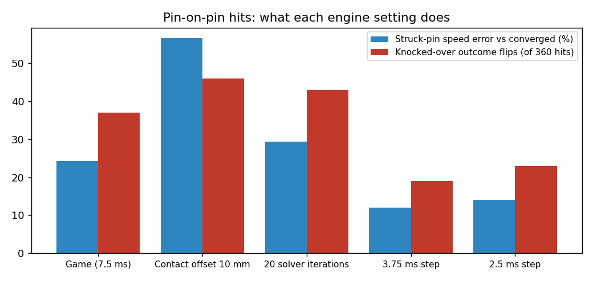
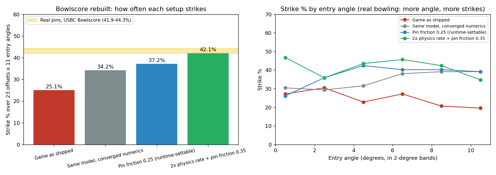

# Pin physics study (BowlingPlus 1.7.0)

What the game's pin physics really is, how it compares with real pins, what BowlingPlus can change, and whether upgrading Unity would help. Every number here comes from the game's own files (1.907) and from simulations in `tools/dev/pinlab`, which anyone can rerun.

## Short answers

- **Can the pin physics be improved?** Yes, measurably. In a copy of the game's own physics, the game strikes **25 %** of the time on the US Bowling Congress's Bowlscore grid, where real pins strike **42-44 %**, and the ball's entry angle makes no difference (in real bowling it matters most). Lowering the pins' friction to **0.25** brings it to **37 %**, makes entry angle matter again, and makes the **10 pin** the most common single-pin leave, as with real right-handed pocket hits. BowlingPlus can set that friction while the game runs, so 1.7.0 does ("Realistic pin physics").
- **Can Unity be upgraded without the source?** Not in practice. The engine is welded to the game's compiled code (IL2CPP) and to its data files; on iPhone both are one binary.
- **Would it be worth it?** No. The game is already on Unity 6 (6000.0.67f1), and Unity's built-in 3D physics is PhysX 4.1 in every version up to the 6.7 alpha. An upgrade wouldn't bring a better physics engine. What limits the pins is the game's settings, not the engine.

## What the game actually does (read from its files)

The pins on the lane are `PinsPhys/PinUnity1..10` (`InventaryData.kegels`), not the `PinHolder` pins the old "Pin physics fix" changed (those never move; the lane doesn't use them). Each pin:

| | Value |
|---|---|
| Mass | 1.644 kg (3.62 lb; regulation 3.375-3.66 lb) |
| Centre of mass | 0.1498 m up the axis (`RunPsycsTest.pinCenterMass`) |
| Inertia | 0.013934 (tipping), 0.001915 (spin) kg m² (`pinInertiaTensor`) |
| Colliders | five convex hulls + a 6.1 cm capsule at the belly + a 3.2 cm sphere at the head; 0.379 m tall, belly radius 0.060 m (regulation 0.381 m, 0.0605 m) |
| Materials | "Pin": friction 0.5 sliding / 0.3 starting, bounce 0.65; "PinButtom" (base): bounce 0.4; combine mode Minimum |
| Collision | Discrete |
| At every rack | `InventaryData.ResetRigidBody` destroys the pin's Rigidbody and adds a new one, with max depenetration and max angular velocity 100000 (so no 7 rad/s spin cap) |

The rack is a regulation 12-inch triangle (head pin at y 18.263 m). The ball: radius 0.108 m, "Ball" material (0.3 / 0.3, bounce 0.65). Deck: friction 0.6 / 0.9, bounce 0.7. Kickbacks: friction 0.01, bounce 0.9. Physics: 7.5 ms step, 7/7 solver iterations, contact offset 0.5 mm, PGS solver, patch friction.

**What BowlingPlus can change while the game runs** (both platforms; everything else was stripped from the engine binary too, not just from the scripts): per body mass, centre of mass, inertia, damping, velocities, collision mode, max angular and depenetration velocity; any physics material's friction (not bounciness). Not reachable: the physics step, solver iterations, contact offset, bounciness, combine modes. (`Time.get_fixedDeltaTime` survives natively, so the step could be found and changed by writing memory; that would also change everything the game does per physics step, like the oil, and is left for later.)

## How it was tested

`tools/dev/pinlab` rebuilds the lane on NVIDIA PhysX 4.1 (built from NVIDIA's source, the engine Unity 6 embeds) with the game's exact pins, materials, deck, lane, gutters, kickbacks, pit, rack and settings, the way Unity drives PhysX (PGS, patch friction, persistent contacts, Minimum combine). Left alone, a full rack stays put to 0.03 mm. Every setup is compared with the same model run at a 0.5 ms step and 20 solver iterations ("converged"), and the full-rack results with real pins (USBC Bowlscore).

## Results

**1. Ball into one pin** (17/20/23 mph, 12 and 15 lb, every 2 cm across the pin). With the game's 7.5 ms step the ball is 25 mm inside the pin on average (up to 50 mm) before the hit is resolved; the pin's launch speed is off by 15 % on average (up to 50 %) and its direction by 6.6° (up to 35°). Continuous collision on the ball changes nothing at these speeds (PhysX only sweeps a body that moves more than its own size in a step). The converged model agrees with rigid-impact theory (about 10.7 m/s pin speed for a head-on 20 mph hit, against 10.3 m/s).

**2. Pin into pin** (sliding, flying broadside, flying head-first, tumbling; 1.5-7 m/s; spin 0/20/45 rad/s; every offset). Nothing passes through anything, and no energy is created. But about 1 hit in 10 ends differently from the converged model (a pin falls that shouldn't, or the other way round), most often for head-first and tumbling pins.



| Change | Struck-pin speed error | Outcome flips (of 360) | Ball-pin speed / angle error |
|---|---|---|---|
| Game (7.5 ms step) | 24 % | 37 | 15 % / 6.6° |
| Contact offset 5-10 mm | 54-57 % | 46-48 | 11-12 % / 6.0-6.4° |
| 20 solver iterations | 29 % | 43 | 16 % / 5.4° |
| 3.75 ms step | 12 % | 19 | 8.9 % / 5.2° |
| 2.5 ms step | 14 % | 23 | 6.0 % / 3.3° |
| Speculative collisions on pins | up to 2132 % on spinning pins | 53 | |

Only a smaller step helps; speculative collisions are harmful (removed in 1.7.0).

**3. Full racks** (300 pocket throws, randomized speed, angle, pocket, revs and pin turns). The game and the converged model strike equally often (29 %), but they leave different pins: the converged model leaves the 10 pin twice as often; the game leaves more 5s, 8s and 7s. Individual throws rarely match: bowling is chaotic, so only distributions can be compared.

**4. Bowlscore, rebuilt.** USBC rolls balls into real pins at 23 offsets (0-5.5 in) and 11 entry angles (0-10°): about 42-44 % strikes over the grid, and ball restitution barely matters (2.5 points across the whole COR range). The same grid in the model:



| Setup | Strikes | 0-3° | 6-10° |
|---|---|---|---|
| Game as shipped | 25.1 % | 28.8 % | 23.0 % |
| Converged model | 34.2 % | 29.9 % | 38.7 % |
| Pin restitution 0.75 (2x rate) | 29.6 % | 28.3 % | 33.5 % |
| Deck friction 0.3 (2x rate) | 40.1 % | 35.3 % | 40.9 % |
| **Pin friction 0.25 (game's step)** | **37.2 %** | **31.0 %** | **40.0 %** |
| Pin friction 0.30 (game's step) | 37.0 % | 30.4 % | 37.8 % |
| Pin friction 0.35 (2x rate) | 42.1 % | 41.3 % | 42.2 % |
| Pin friction 0.2 (2x rate) | 51.4 % | 47.3 % | 52.2 % |

Restitution barely matters, as USBC found with real balls, which backs up the model. Pin friction matters most, and 0.25 at the game's own step is the best setting BowlingPlus can apply today: 12 points closer to real pins, entry angle back, and in pocket throws the 10 pin becomes by far the most common single-pin leave (74 of 300).

## What 1.7.0 does

- **Realistic pin physics** (new "Pin physics" menu category, Practice only): every lane pin collider gets friction 0.25 (adjustable 0.10-0.50; turning it on sets 0.25), and the ball uses continuous collision. Off, outside Practice, or on a new scene, the pins get their own values back.
- **Counts**: first balls (from a full rack) with it on and with it off: strikes, average pins and single-pin leaves, shown in the menu and in Copy debug info, and each first and second ball is logged with its leave.
- **Double physics rate (1.7.1, experimental)**: the engine's fixed step halved to 3.75 ms (friction stays 0.25), with a speed check on every throw that undoes it if physics runs at the wrong speed.
- **Removed**: the old "Pin physics fix" (it changed pins that never move) and "Improve spinning pin collision" (speculative collisions, harmful for spinning pins).

## Double physics rate (1.7.1)

The game's 7.5 ms step can't be set through Unity here, but the engine's own setting can be changed in memory (VERIFIED_NOTES 5g). More shots to separate the options (1,012 Bowlscore shots each, ±3 points at 95 %), with 300 pocket throws:

| Setup | Bowlscore strikes | 0-3° | 6-10° | Pocket throws | Most common single-pin leaves |
|---|---|---|---|---|---|
| Game step, friction 0.25 (1.7.0) | 37.5 % | 31.5 % | 39.3 % | 37.3 % | 10 (74), 5 (23) |
| **Double rate, friction 0.25** | **40.5 %** | **33.2 %** | **43.9 %** | **45.7 %** | **10 (67), 5 (48)** |
| Double rate, friction 0.30 | 38.5 % | 31.5 % | 40.0 % | 47.3 % | 5 (58), 10 (40) |
| Double rate, friction 0.35 | 41.7 % | 39.4 % | 42.6 % | 46.7 % | 5 (94), 10 (18) |
| Double rate, friction 0.40 | 37.5 % | 40.2 % | 33.0 % | 44.0 % | 5 (91), 8 (20) |

The double rate with friction 0.25 is the best balance: closest to real pins' 42-44 % with the strongest entry-angle effect, and the 10 pin is still the most common leave (higher friction makes the 5 pin dominate, which real pocket hits don't). The 42.1 % first reported for friction 0.35 came from fewer shots and was within noise.

## Limits

- The model is the game's own physics, not real pins; it's compared with real pins only through Bowlscore's strike rates, and its ball is a straight-rolling ramp ball (Bowlscore's ball also comes off a ramp).
- Whether a change *feels* right can only be judged on the phones; the counts in the menu are there for that.
- The physics step (the main numerical error) stays as the game has it.

## Rerunning it

```
tools/dev/pinlab/build_physx.sh                    # PhysX 4.1 from GitHub + pinlab (about 3 minutes)
cd tools/dev/pinlab
./pinlab rest scene.txt stock ref                  # a rack left alone
./pinlab ballpin scene.txt stock ref > ballpin.csv
./pinlab pinpin scene.txt stock dt375 ref > pinpin.csv
PINLAB_N=300 ./pinlab rack scene.txt stock ref > rack.csv
./pinlab bowlscore scene.txt stock stock_pf025 ref > bowlscore.csv
python3 export_scene.py <the game's Data folder> scene.txt   # re-export the scene from the game's files
```
